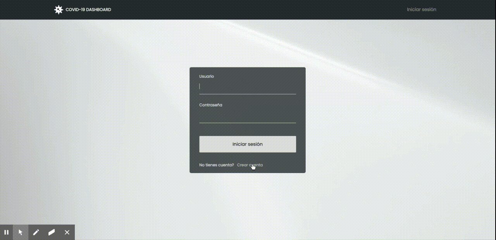

### Covid-19 Dashboard Project       
> Web UI donde llamar una API con información sobre la propagación de Covid19 en el mundo.
  Hecho con Python/Django


## Sitio web
Puedes ver el proyecto en funcionamiento aquí -> [COVID-19 Dashboard](https://cvd19dashboard.herokuapp.com/).

## Video/GIF de cómo funciona

  

## Proyecto

La idea del proyecto es crear una web UI donde se llama a una API con
información sobre la propagación de Covid19 en el mundo.            
El objetivo es analizar, resumir y
extraer información relevante del comportamiento del virus por país.    
Al ingresar al sitio, debes iniciar sesión, creando una cuenta si es necesario
para poder visualizar el dashboard.


## Tests

Se han implementado unos pequeños test para asegurar que un usuario no registrado
no tiene acceso al dashboard, y la aplicación envía a este a la página de inicio de
sesión automáticamente.


## Diseño

El diseño es sobrio y minimalista, con tonos siempre entre el blanco y el negro,
pero no completamente negro,  
para proyectar cierta sensación de control y seguridad pese a la gravedad del tema
sobre el que se está tratando.
Se ha usado Html y Css sin ningún framework ya que se trata de un proyecto sencillo.


## Nota sobre la API

Este es el link de la API https://rapidapi.com/Gramzivi/api/covid-19-data.        

Debido al mal funcionamiento de esta, no es posible obtener los datos en el día de la consulta.     
Para este proyecto se ha usado como fecha el 16 de junio del 2020, última fecha en que todos
los endpoints tienen la información necesaria.

Para este proyecto se usa una versión Free de la API, con limitación de 1 request por segundo.
Debido a esto hay un tiempo de espera mínimo de unos 4-6 segundos en la página principal del dashboard.
Se ha implementado un sistema de espera para cumplir las restricciones con el menor tiempo de espera para el usuario.    
En caso de ser una web operativa se habría optado por una versión de pago de la API para acelerar
el tiempo de carga.


## Quick Start

To get this project up and running locally on your computer:
1. Set up the [Python development environment](https://developer.mozilla.org/en-US/docs/Learn/Server-side/Django/development_environment).
    It is recommended to use a Python virtual environment.
1. Assuming you have Python setup, run the following commands (if you're on Windows you may use `py` or `py -3` instead of `python` to start Python):
    ```
    git clone https://github.com/jaumemy/whaleandjaguar-project.git
    pip3 install -r requirements.txt
    python3 manage.py runserver
    ```
1. Open a browser to `http://127.0.0.1:8000/` to open the  site
